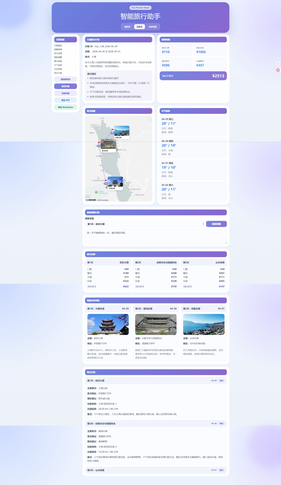
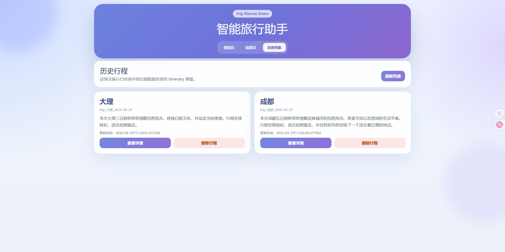
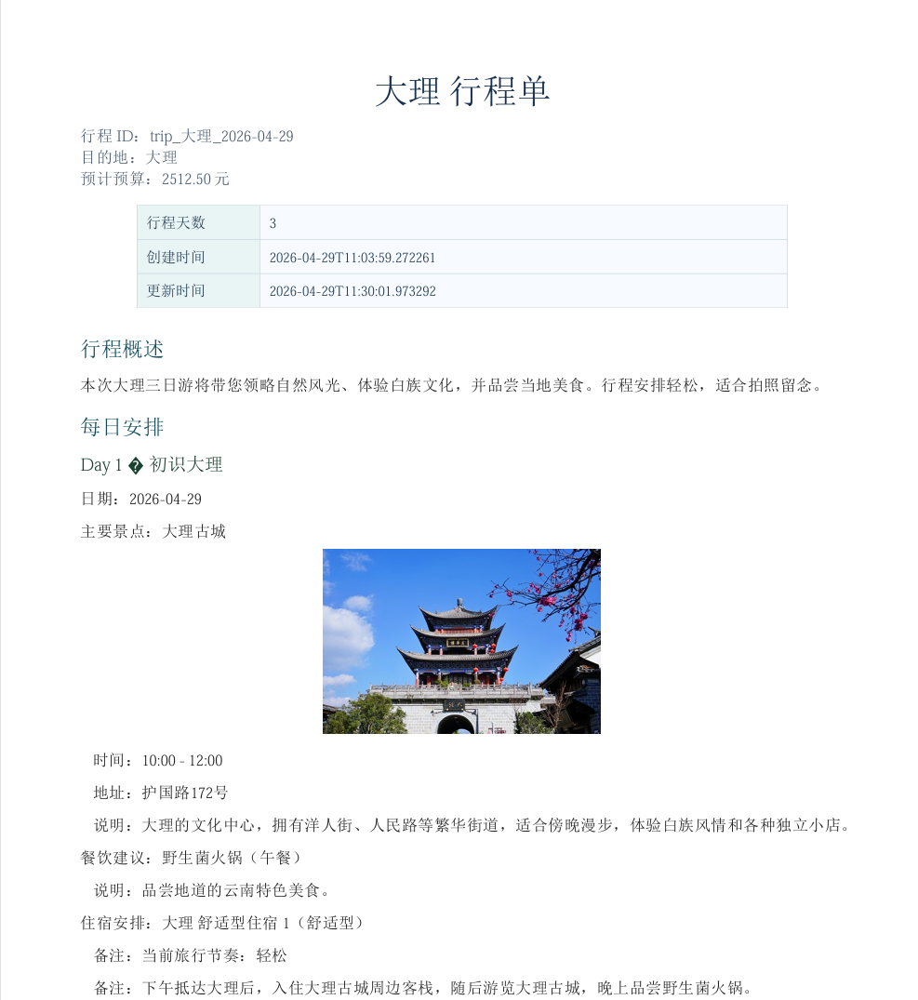
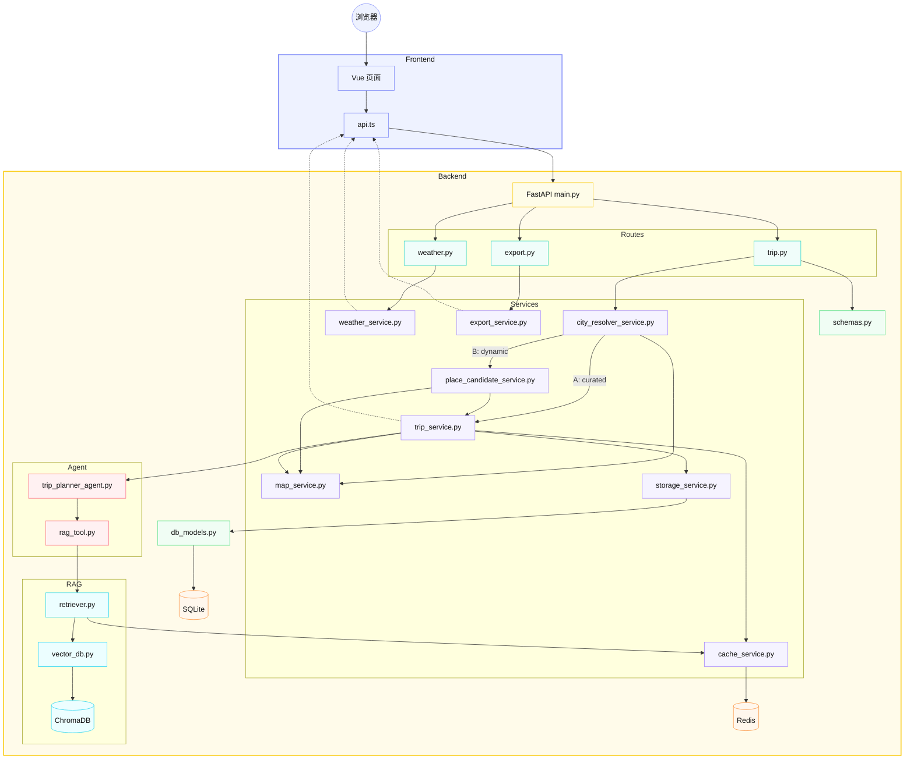
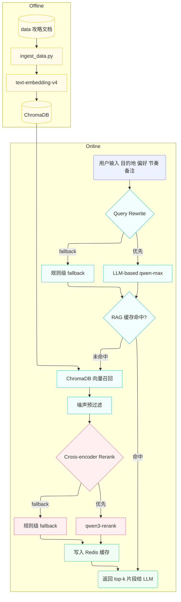
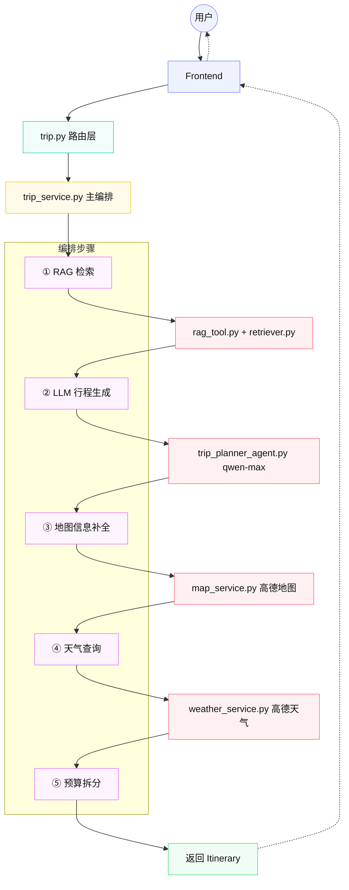

# 🗺️ 智旅云图

> 融合大模型、RAG、本地攻略与高德地图能力的智能旅行规划系统

[](https://github.com/paofan666/travel-plan-agent/actions/workflows/ci.yml)


[效果展示](#-效果展示) · [项目亮点](#-项目亮点) · [技术架构](#️-技术架构) · [快速启动](#-启动项目) · [接口文档](#-核心接口) · [测试验证](#-测试与验证)

智旅云图是一个面向中文旅行场景的 AI 旅行规划项目。用户输入目的地、日期、预算、人数和偏好后，系统会自动生成结构化旅行方案，并进一步补充地图点位、天气信息、预算拆分、景点图片与可导出的旅行文档。

相比只输出一段文本的 LLM Demo，这个项目更强调完整链路落地：从 **行程生成、攻略检索、地图信息补全、天气补充，到历史管理与文档导出**，尽量把 AI 能力组织成一个可交互、可保存、可展示的产品原型。

> **快速体验**：准备好 OpenAI-compatible 模型与高德地图 Key 后，分别复制 `backend/.env.example` 和 `frontend/.env.example`，填写配置，再按照[启动项目](#-启动项目)分别运行前后端。

## 📝 最近更新

<details>
<summary><strong>查看版本更新记录（最新：2026-05-26）</strong></summary>

- `2026-05-26`
  - 动态城市：新增 A/B/C 覆盖分级。6 个已沉淀城市继续走本地 RAG；其他可识别城市在候选充足时，通过高德景点、餐饮和住宿 POI 候选直接生成动态方案。用户已手工验证多个城市可以生成。
  - 真实性约束：动态 Planner 只输出候选 POI ID，服务层校验后回填真实名称、地址、坐标和图片；模型不可用或返回越界 ID 时，也只从本次真实候选池降级。
  - 输入边界：当前支持单城市规划。青海等普通省级目的地会提示改用具体城市；上海、北京、天津和重庆等直辖市仍按城市处理。
  - 边界加固：区县级目的地改用行政区 `adcode` 精确过滤候选；明确取消景点时保留空景点列表，避免“自由活动”被地图重新绑定；地图故障会返回脱敏的失败阶段与原因。该组改动待本地回归验收。
- `2026-05-25`
  - RAG：知识库扩展为北京、大理、成都、西安、厦门、三亚 6 个目的地；Chunk 写入 `destination` metadata，Chroma 向量检索、关键词 fallback、Rerank 与缓存均按目的地隔离，跨城市污染评估自动纳入北京。
  - 数据质量：检索扩展词迁移到 `backend/data/retrieval_rules.json`；RAG 评估集更新为 18 条并与当前攻略内容对齐；新增离线一致性校验，能够发现失效规则词、fallback 候选和评估断言词。
  - 失败降级：模型不可用或候选不足时，行程只展示从当前 RAG 上下文提取的景点、餐饮和住宿名称；没有真实候选就明确留空，不再生成“推荐景点 N”类模板实体。
  - 开发体验：新增模型连通性检测脚本，Chat 与 Embedding 可分别诊断。
- `2026-05-19`
  - 工程观测：新增 token 消耗统计，覆盖 Query Rewrite、Query Embedding、qwen3-rerank 与 Planner 生成链路，并在后端终端输出分项与总量。
  - 接口能力：`/trip/generate` 返回 `token_usage` 字段，`/trip/stats` 支持汇总已保存行程的 token 消耗。
- `2026-05-07`
  - RAG：完成 Cross-encoder Rerank（qwen3-rerank）+ 噪声预过滤，Top1 命中率 86.7%→93.3%，MRR 0.922→0.967。
  - RAG：新增 Rerank 缓存，缓存命中后 Avg Latency 从 728ms 降至 425ms，降幅 41.6%。
- `2026-05-06`
  - RAG：完善评估指标体系，新增 MRR、Noise Rate、Latency、Cross-destination Pollution 四个量化指标。
  - RAG：完成 LLM-based Query Rewrite，用 qwen-max 替代手写规则改写检索 query，Top1 命中率 80%→86.7%，MRR 0.889→0.922。
- `2026-04-29`
  - RAG：扩充知识库至 5 个目的地（大理/成都/西安/厦门/三亚），评估样例集扩充至 15 条，完成规则级 Rerank 多层降权与 Query Rewrite 目的地过滤，消除跨目的地污染。
  - 地图前端：新增地图路线虚线箭头可视化、🚩 旗帜打卡标记与景点图片气泡窗口。
- `2026-04-25`：完成第一轮 RAG 在线阶段优化，已接入轻量化 Query Rewrite、轻量 Rerank 与检索调试脚本。
- `2026-04-15`：新增 Redis 缓存层，已覆盖天气查询、地图查询与 RAG 检索结果缓存。

</details>

更多更新见：[CHANGELOG.md](./CHANGELOG.md)

> **数据边界**：6 个本地 Markdown 攻略用于 RAG 参考；动态城市的地点实体来自当次高德 POI 候选。两条路径都不代表门票、酒店价格、营业状态或可预订性已经实时核验，相关金额目前属于规划估算。

---

## 📸 效果展示

### 规划页


### 行程生成结果页



### 保存与历史管理



### PDF 导出效果



---

## ✨ 项目亮点

- 🧠 **LLM 行程生成**：基于 LangChain 与 OpenAI-compatible 接口生成结构化旅行计划，Chat、Embedding、Rerank 模型可分别配置
- 📚 **本地攻略检索**：覆盖北京、大理、成都、西安、厦门、三亚 6 个目的地，为行程生成补充对应城市的攻略信息，并避免跨城市内容混入
- 🌐 **动态城市规划**：未沉淀城市先经过行政区解析，再采集景点、餐饮和住宿 POI；候选达到阈值后生成完整方案，用户已手工验证多个城市可用
- 🗺️ **高德地图接入**：补充景点地址、经纬度、POI ID、路线距离、耗时和景点图片，并支持虚线箭头路线可视化与 🚩 打卡标记
- 🌦️ **天气感知提示**：前端展示天气预报，并根据雨天/阴天自动修正旅行提示
- ⚡ **Redis 缓存层**：覆盖天气、地图、RAG 检索与 Rerank 结果缓存，减少重复外部调用开销
- 📊 **Token 消耗统计**：按 Query Rewrite、Query Embedding、Rerank、Planner 分项统计输入/输出 token，并在后端日志与接口响应中返回总量
- 💰 **预算拆分**：按交通、住宿、餐饮、门票、其他费用拆分，并支持按天展示
- 🪄 **智能编辑**：支持用户用自然语言调整某一天行程
- 🗂️ **历史管理**：支持保存、查看、打开、删除历史 itinerary
- 📄 **文档导出**：支持 Markdown 和中文 PDF 导出，导出前自动同步当前页面数据
- 🖥️ **前端可视化**：提供规划页、结果页和历史页，完成核心业务闭环展示

---

## 🏗️ 技术架构

### 技术栈

- 后端：FastAPI + Pydantic + SQLAlchemy
- LLM：LangChain
- 向量库：ChromaDB
- 缓存：Redis
- 外部服务：HTTPX + 高德地图 Web 服务 + 高德 JavaScript API
- 前端：Vue 3 + Vite
- 数据库：SQLite

### 核心架构分层

| 层级 | 关键文件 | 职责 |
| :--- | :--- | :--- |
| 前端 | `frontend/src/views/*.vue` | 规划页、结果页、历史页展示与交互 |
| 接口层 | `backend/app/api/routes/` | trip、export、weather 路由 |
| 服务层 | `backend/app/services/` | 城市解析、动态候选、行程编排、地图 enrich、天气、缓存、导出、存储 |
| Agent 层 | `backend/app/agents/` | 本地 RAG Planner、动态 POI ID Planner、LLM-based Query Rewrite |
| RAG 层 | `backend/app/rag/` | 向量入库、检索、Cross-encoder Rerank |
| 数据层 | `backend/data/` | 本地 Markdown 攻略文档 |

### 系统数据流



数据流路径：前端收集用户输入 → 后端解析目的地覆盖等级 → 已沉淀城市走本地 RAG，未沉淀城市采集高德 POI 并进行 ID 受约束规划 → 地图与天气服务补充信息 → 前端展示地图、预算和每日行程 → 用户可保存、编辑、查看历史并导出文档。

### 数据存储与缓存分工

项目中将长期业务数据和短期高频查询结果分开处理：

- **SQLite：负责持久化存储**
  - 实现位置：`backend/app/config.py`、`backend/app/models/db_models.py`、`backend/app/services/storage_service.py`
  - 使用场景：保存用户生成后的完整旅行方案，并支持历史列表、详情查询、删除和 Markdown/PDF 导出。
  - 存储方式：通过 SQLAlchemy 定义 `TripRecord` 表，核心字段包括 `trip_id`、`destination`、`summary`、`itinerary_json`、`created_at`、`updated_at`。
  - 设计原因：旅行方案属于用户主动保存的业务数据，需要长期保留、可查询、可删除；当前阶段采用 SQLite 轻量部署，适合个人项目和 Demo 场景。

- **Redis：负责缓存加速**
  - 实现位置：`backend/app/services/cache_service.py`，并被 `weather_service.py`、`map_service.py`、`retriever.py` 复用。
  - 使用场景：缓存天气查询、高德地图地理编码/POI/路线结果、RAG 检索结果和 qwen3-rerank 重排序结果。
  - 存储方式：业务模块生成缓存 key，`cache_service.py` 统一加上 `trip_planner` 前缀，将 Python `dict/list` 序列化为 JSON 字符串写入 Redis，并设置 TTL 自动过期。
  - 设计原因：天气、地图和 RAG/Rerank 结果存在明显重复查询，且在一段时间内相对稳定；使用 Redis 可以减少外部 API 调用和重复检索开销，提升接口响应速度与稳定性。

简言之：**SQLite 存“用户要留下来的行程数据”，Redis 存“短时间内可复用的中间查询结果”。**

### RAG 检索流程



**离线阶段**

```text
本地 Markdown 攻略 → 按标题切块（49 个片段） → text-embedding-v4 转向量 → 写入 ChromaDB
```

这一步只做一次，数据入库后就不再动了。

**在线阶段**

```text
用户输入（目的地 / 偏好 / 节奏 / 备注）
    ↓
① Query Rewrite（LLM-based / 规则 fallback）
    输出：检索关键词，如"大理 美食 拍照 古城 洱海"
    ↓
② Embedding（同一个 text-embedding-v4）
    把检索关键词转向量，才能和 ChromaDB 里的文档向量做相似度计算
    ↓
③ 向量召回（ChromaDB）
    用向量相似度找到 top-6 候选片段
    ↓
④ 噪声预过滤
    去掉"文档开头"等低信息量片段，避免浪费 rerank 的 API 调用
    ↓
⑤ Cross-encoder Rerank（qwen3-rerank / 规则 fallback）
    语义级重排序，选出 top-3 最相关片段
    ↓
⑥ 写入 Redis 缓存
    RAG 缓存：query → top-k 文本
    Rerank 缓存：query + 候选哈希 → 排序分数
    ↓
⑦ 返回 top-k 文本给 LLM
    和用户信息一起组装成 prompt，调 qwen-max 生成行程
```

---

## 📁 项目结构

```text
TripPlannerDemo/
├── backend/
│   ├── app/
│   │   ├── config.py                  # 环境变量、数据库与全局配置
│   │   ├── agents/
│   │   │   ├── trip_planner_agent.py  # LLM 行程生成与单日编辑
│   │   │   └── tools/
│   │   │       └── rag_tool.py         # 查询改写与检索规则加载
│   │   ├── api/
│   │   │   ├── main.py                 # FastAPI 应用入口
│   │   │   └── routes/
│   │   │       ├── trip.py             # 行程生成、编辑与历史接口
│   │   │       ├── export.py           # Markdown / PDF 导出接口
│   │   │       └── weather.py          # 天气预报接口
│   │   ├── models/
│   │   │   ├── schemas.py              # Pydantic 请求与响应模型
│   │   │   └── db_models.py            # SQLAlchemy 数据表定义
│   │   ├── rag/
│   │   │   ├── guide_catalog.py        # 攻略文件与目的地映射
│   │   │   ├── vector_db.py            # 文档切片、Chroma 入库与检索
│   │   │   ├── retriever.py            # 检索、重排序与缓存
│   │   │   └── knowledge_validation.py # 攻略、规则与评估配置一致性校验
│   │   └── services/
│   │       ├── trip_service.py         # 行程主编排、预算与地图补全
│   │       ├── city_registry_service.py # 城市覆盖注册表与名称规范化
│   │       ├── city_resolver_service.py # 行政区解析与 A/B/C 覆盖判断
│   │       ├── place_candidate_service.py # 动态景点、餐饮、住宿候选池
│   │       ├── fallback_candidates.py  # 从攻略上下文提取真实候选
│   │       ├── map_service.py          # 高德 POI、路线与图片
│   │       ├── weather_service.py      # 天气服务
│   │       ├── storage_service.py      # SQLite 行程存储
│   │       ├── cache_service.py        # Redis 缓存与降级
│   │       └── export_service.py       # Markdown / PDF 导出
│   ├── data/
│   │   ├── *_guide.md                  # 6 个目的地的本地攻略
│   │   └── retrieval_rules.json        # 查询扩展词配置
│   ├── eval/rag_eval_cases.json        # RAG 评估样例集
│   ├── scripts/                         # 数据入库、调试、评估与校验脚本
│   ├── tests/                           # pytest 测试
│   ├── .env.example                     # 后端环境变量模板
│   └── requirements.txt
├── frontend/
│   ├── src/
│   │   ├── views/
│   │   │   ├── Home.vue                 # 规划页面
│   │   │   ├── Result.vue               # 行程结果页面
│   │   │   └── History.vue              # 历史行程页面
│   │   ├── components/
│   │   │   └── AmapTripMap.vue          # 地图展示组件
│   │   ├── services/api.ts              # 后端接口封装
│   │   ├── types/                       # TypeScript 类型定义
│   │   ├── App.vue
│   │   └── main.ts
│   ├── .env.example                     # 前端环境变量模板
│   └── package.json
├── docs/                                # 架构、数据与优化文档
├── assets/showcase/                     # README 展示截图
├── README.md
└── CHANGELOG.md
```

> `docs/` 是本地开发与面试准备文档目录，默认已被 `.gitignore` 忽略，不随 GitHub 上传。

### 关键文件职责

**后端**

- `backend/app/services/trip_service.py`
  A 级 RAG 行程与 B 级动态行程的主流程编排，包括 POI ID 校验、预算估算和编辑后的统一刷新。
- `backend/app/services/city_resolver_service.py`
  规范化目的地并结合本地注册表与高德行政区结果，区分沉淀城市、动态城市、资料不足和不支持的省级输入。
- `backend/app/services/place_candidate_service.py`
  按城市采集景点、餐饮和住宿 POI，过滤跨城市、无坐标和重复结果，并校验最低候选覆盖。
- `backend/app/services/cache_service.py`
  Redis 客户端懒加载、JSON 缓存读写与 Redis 不可用时的优雅降级。
- `backend/app/agents/trip_planner_agent.py`
  调用大模型生成结构化旅行草稿；动态城市 Planner 只允许输出候选 POI ID，并处理单日编辑时的 LLM 输出。
- `backend/app/agents/tools/rag_tool.py`
  RAG 在线阶段的 Query Rewrite，优先 LLM-based 改写（qwen-max），fallback 到规则级关键词提取。
- `backend/app/rag/retriever.py`
  向量召回结果封装、RAG 缓存、Cross-encoder Rerank（qwen3-rerank）+ Rerank 缓存，fallback 到规则级打分。
- `backend/app/services/map_service.py`
  对接高德地图 Web 服务，结合 Redis 缓存补充地址、经纬度、路线估算和景点图片。
- `backend/app/services/export_service.py`
  itinerary 渲染为 Markdown 与中文 PDF。
- `backend/app/services/storage_service.py`
  SQLite 数据保存、读取、历史列表和删除。
- `backend/scripts/debug_rag_retrieval.py`
  RAG 在线阶段调试，输出检索 query、top-k 召回片段、`rerank_score` 与 `rerank_reasons`。
- `backend/scripts/evaluate_rag_retrieval.py`
  RAG 检索效果评估，输出 Top1/TopK 命中率、MRR、Noise Rate、Latency 与跨目的地污染指标。
- `backend/eval/rag_eval_cases.json`
  RAG 检索评估样例集，用于对比优化前后的效果变化。

**前端**

- `frontend/src/services/api.ts`
  Axios 封装与后端接口通信。
- `frontend/src/views/Home.vue`
  规划页，收集用户输入并发起行程生成请求。
- `frontend/src/views/Result.vue`
  结果展示页，承接 itinerary、地图、天气和导出交互。
- `frontend/src/views/History.vue`
  历史列表页，支持查看、打开和删除历史行程。
- `frontend/src/components/AmapTripMap.vue`
  高德地图组件，展示路线可视化与景点标记。

---

## 🚀 启动项目

项目当前采用本地运行方式。需要本机已安装 Python 3.11、Node.js 与 npm，后端和前端请分别在两个终端中启动。

### 1. 配置并启动后端

```powershell
cd backend
Copy-Item .env.example .env
# 编辑 .env，填写 LLM、Embedding 和高德地图等配置
pip install -r requirements.txt
uvicorn app.api.main:app --host 0.0.0.0 --port 8000
```

后端启动后可访问：

```text
API:      http://127.0.0.1:8000
API 文档: http://127.0.0.1:8000/docs
```

首次使用 RAG 时，另开终端执行以下命令将本地攻略写入 Chroma：

```powershell
cd backend
python scripts/ingest_data.py
```

### 2. 配置并启动前端

```powershell
cd frontend
Copy-Item .env.example .env
# 本机运行时，将 VITE_API_BASE_URL 配置为 http://127.0.0.1:8000
npm install
npm run dev
```

前端地址：`http://127.0.0.1:5173`。

### 3. 可选：开启本地 Redis 缓存

默认 `REDIS_ENABLED=false`，即使未安装 Redis 也可以运行项目。若本机已安装 Redis，可运行 `redis-server`，再将 `backend/.env` 中的 `REDIS_ENABLED` 改为 `true`，以启用天气、地图和检索缓存。

## 🔐 环境变量

### 后端 `backend/.env`

```env
# LLM
LLM_PROVIDER=openai_compatible          # 固定值，使用 OpenAI 兼容接口
LLM_API_KEY=your_api_key                # OpenAI-compatible 服务的 API Key
LLM_MODEL=your_chat_model               # 生成模型，例如 deepseek-v4-flash
LLM_BASE_URL=https://your-provider/v1   # 服务的 OpenAI-compatible 地址
LLM_TIMEOUT_SECONDS=120                 # 单次 LLM 调用超时
LLM_MAX_RETRIES=1                       # 失败重试次数

# RAG / 向量库
CHROMA_DB_DIR=db/chroma_db              # ChromaDB 持久化目录
CHROMA_COLLECTION_NAME=travel_guides    # 集合名称
EMBEDDING_MODEL=your_embedding_model    # 嵌入模型，例如 qwen3.7-text-embedding
EMBEDDING_BATCH_SIZE=10                 # 单批嵌入条数
RERANK_MODEL=qwen3-rerank              # DashScope Rerank 模型

# Redis / 缓存
REDIS_ENABLED=false                     # 是否开启缓存（需先启动 Redis）
REDIS_URL=redis://127.0.0.1:6379/0     # Redis 连接地址
REDIS_KEY_PREFIX=trip_planner           # 缓存 key 前缀，避免多项目冲突
REDIS_DEFAULT_TTL_SECONDS=1800          # 默认缓存 30 分钟
REDIS_WEATHER_TTL_SECONDS=1800          # 天气缓存 30 分钟
REDIS_MAP_TTL_SECONDS=86400             # 地图缓存 24 小时
REDIS_RAG_TTL_SECONDS=21600             # RAG 检索缓存 6 小时
REDIS_RERANK_TTL_SECONDS=21600          # Rerank 缓存 6 小时

# 高德地图
AMAP_API_KEY=your_amap_web_service_key  # 高德 Web 服务 Key
AMAP_BASE_URL=https://restapi.amap.com/v3
AMAP_DEFAULT_CITY=                      # 默认城市（可留空）
AMAP_TIMEOUT_SECONDS=20                 # 高德接口超时
ENABLE_AMAP_ENRICHMENT=true             # 是否开启地图信息补全
```

### 前端 `frontend/.env`

```env
VITE_API_BASE_URL=http://你的服务器地址:8000
VITE_AMAP_JS_KEY=your_amap_javascript_api_key
```

注意：

- 如果浏览器在本机打开，`VITE_API_BASE_URL` 不要写远程服务器内部的 `127.0.0.1`
- 后端高德 key 使用 Web 服务 key
- 前端地图 key 使用 JavaScript API key
- 修改 `.env` 后需要重启对应服务

---

## 🧠 RAG 数据初始化

首次使用 Chroma 检索前，执行：

```bash
cd backend
python scripts/ingest_data.py
```

成功后会看到类似结果：

```text
written_count: 9
```

---

## 📡 核心接口

| 方法 | 路径 | 说明 |
| :--- | :--- | :--- |
| `GET` | `/` | 服务启动检查 |
| `GET` | `/health` | 健康检查 |
| `POST` | `/trip/generate` | 生成行程 |
| `GET` | `/trip/stats` | 查询已保存行程的 token 消耗统计 |
| `POST` | `/trip/edit` | 智能编辑行程 |
| `POST` | `/trip/save` | 保存行程 |
| `GET` | `/trip` | 历史列表 |
| `GET` | `/trip/{trip_id}` | 行程详情 |
| `DELETE` | `/trip/{trip_id}` | 删除行程 |
| `GET` | `/export/{trip_id}/markdown` | 导出 Markdown |
| `GET` | `/export/{trip_id}/pdf` | 导出 PDF |
| `GET` | `/weather/forecast` | 查询天气 |

---

## 🧪 测试与验证

### 后端 API 测试

```bash
cd backend
pytest tests -q
```

### 高德服务测试

```bash
cd backend/scripts
python test_map_service.py
```

### 真实行程生成测试

```bash
cd backend/scripts
python test_trip_service_real.py
```

---

## 🔄 关键业务链路

### 显式编排工作流

项目采用显式编排（而非 Agent 自主决策）的方式组织业务流程，每个步骤由 `trip_service.py` 按固定顺序调用，适合当前业务确定性强、步骤可预期的场景。



### 行程生成

```text
POST /trip/generate
  -> trip.py（路由层）
    -> trip_service.py（主编排）
      -> ① rag_tool.py
           Query Rewrite（LLM-based / 规则 fallback）
           -> retriever.py
               RAG 缓存检查
               -> ChromaDB 向量召回
               -> 噪声预过滤
               -> Cross-encoder Rerank（缓存 -> API -> 规则 fallback）
      -> ② trip_planner_agent.py
           组装 Prompt（用户输入 + RAG 上下文）
           -> qwen-max 生成结构化行程
           -> Pydantic 校验输出
      -> ③ map_service.py（逐景点）
           地理编码 -> POI 搜索 -> 路线估算 -> 图片补充
           （每步都有 Redis 缓存）
      -> ④ weather_service.py
           天气预报查询（Redis 缓存）
      -> ⑤ 预算拆分计算
      -> ⑥ 记录 token_usage（Query Rewrite / Query Embedding / Rerank / Planner / Total）
      -> 返回 Itinerary
```

### 智能编辑

```text
POST /trip/edit
  -> trip.py（路由层）
    -> trip_service.py（主编排）
      -> ① 定位目标 DayPlan（根据 edit_scope 解析 day_index）
      -> ② trip_planner_agent.py
           generate_day_edit_draft（LLM 生成单日编辑）
           -> 失败则 fallback 到规则编辑（关键词匹配）
      -> ③ 替换目标 DayPlan（theme / spots / meals / notes）
      -> ④ map_service.py 重新 enrich（清除旧坐标，重新查询）
      -> ⑤ 更新 tips 和 source_notes
      -> 返回更新后的 Itinerary
```

### 保存与导出

```text
POST /trip/save
  -> storage_service.py -> SQLite 持久化

GET /export/{trip_id}/markdown
  -> storage_service.py 读取 itinerary
  -> export_service.py -> Jinja2 渲染 Markdown

GET /export/{trip_id}/pdf
  -> storage_service.py 读取 itinerary
  -> export_service.py -> ReportLab 生成中文 PDF
  -> Content-Disposition 返回下载文件名（RFC 编码兼容中文）
```

---

## 🛠️ 常见问题

### 前端生成失败

优先检查：

- 后端是否启动在 `8000`
- `frontend/.env` 的 `VITE_API_BASE_URL` 是否正确
- 修改 `.env` 后是否重启前端
- 浏览器控制台是否有网络错误

### 地图不显示

优先检查：

- `VITE_AMAP_JS_KEY` 是否配置
- 高德 JavaScript API key 是否可用
- itinerary 中是否有经纬度字段
- 后端 `ENABLE_AMAP_ENRICHMENT` 是否为 `true`

### PDF 导出空白页

正常导出时后端应看到：

```text
POST /trip/save
GET /export/{trip_id}/pdf
```

如果只有 `POST /trip/save`，说明前端没有成功跳转到导出地址，需要刷新前端或重启 Vite。

### `npm run dev` 找不到 `package.json`

说明目录错了。前端命令必须在 `frontend/` 目录执行：

```bash
cd frontend
```

---

## ✅ 当前完成度

- ✅ **后端能力**：行程生成、智能编辑、保存查询、历史列表、删除、天气查询、Markdown 导出与 PDF 导出接口
- ✅ **AI 与数据能力**：6 城本地攻略 RAG 路径 + 未沉淀城市动态 POI 路径；动态 Planner 通过 POI ID 白名单选择景点、餐饮和住宿，用户已手工验证多个城市可生成
- ✅ **RAG 在线优化**：LLM-based Query Rewrite + Cross-encoder Rerank（qwen3-rerank）+ 噪声预过滤 + Rerank 缓存、目的地 metadata 过滤、检索调试脚本与 18 条评估样例集、量化评估指标体系（Top1/TopK Hit Rate、MRR、Noise Rate、Latency、Cross-destination Pollution）
- ✅ **Token 观测能力**：`/trip/generate` 返回本次 Query Rewrite、Query Embedding、Rerank、Planner 的分项 token 消耗，后端终端同步打印 prompt/completion/total，`/trip/stats` 汇总已保存行程的 token 统计
- ✅ **前端能力**：规划页、结果页、历史列表页，以及地图/天气/预算展示、导出与历史管理主流程
- ✅ **缓存与持久化**：SQLite 持久化存储 + Redis 缓存层（覆盖天气、地图、RAG 检索与 Rerank 结果）
- ✅ **数据一致性与失败降级**：规则、fallback、评估断言与目的地 metadata 可离线校验；RAG 和动态候选路径均不生成模板化地点，模型返回候选池外 ID 时自动拒绝
- ⚠️ **数据边界**：当前 Markdown 攻略仅作参考知识；价格、营业状态和可预订性尚未逐条接入可追溯的实时或人工核验来源
- ⚠️ **外部模型依赖**：本地离线测试已通过；实际 Chat、Embedding、Rerank 调用仍取决于模型账户状态、模型开通情况和 `.env` 配置

---

## 🌱 后续优化方向

- ✅ **缓存与工程化能力**
  已完成 Redis 缓存层，覆盖天气查询、地图查询、RAG 检索结果与 Rerank 结果缓存；后续可扩展到会话态管理、热点目的地复用与更细粒度的缓存命中统计。
- ✅ **RAG 检索增强**
  - ✅ 规则级 Query Rewrite → LLM-based Query Rewrite（qwen-max），Top1 80%→86.7%，MRR 0.889→0.922。
  - ✅ 规则级 Rerank → Cross-encoder Rerank（qwen3-rerank）+ 噪声预过滤 + Rerank 缓存，Top1 86.7%→93.3%，MRR 0.922→0.967。
  - ✅ 知识库已覆盖 6 个目的地，评估样例集 18 条；规则、fallback、评估断言与目的地 metadata 已有离线一致性校验。模型账户恢复后需重新执行真实 RAG 评估，建立新的在线质量基线。
- 🚧 **Token 成本分析看板**
  已完成后端 token 统计与 `/trip/stats` 汇总接口，后续可在前端增加成本分析面板，对比不同 RAG 策略下的 token 消耗、延迟和生成质量。
- 🚧 **检索结果压缩与去冗**
  RAG 召回片段可能存在重复或冗余信息，送入 LLM 前做一次压缩去重，减少 token 消耗，提升生成质量。
- 🚧 **混合检索（向量 + BM25）**
  当前只用向量检索，加上 BM25 关键词检索后用 RRF（Reciprocal Rank Fusion）融合排序，同时覆盖语义相似和关键词精确匹配的场景。
- 🚧 **PDF 导出优化**
  当前 PDF 可读性较低，后续可优化排版（分栏、卡片式布局）、中文字体、景点图片嵌入、天气图标和路线示意图，生成更接近旅行手册风格的导出文档。
- 🚧 **知识库来源扩充**
  可接入小红书等社交平台的旅行帖子，通过多模态解析（图文提取、结构化摘要）将真实游记转化为本地知识库素材，补充官方攻略覆盖不到的体验细节和实用 tips。
- 🚧 **LangGraph 工作流**
  当前以 LangChain 线性编排为主，后续可引入 LangGraph 把生成、检索、地图 enrich、天气补充、编辑与导出组织成状态机，支持条件分支与并行执行；进一步可引入基于 LLM 的意图识别路由，让系统先判断用户请求类型再分发到对应处理链路。
- 🚧 **真实商户信息深化**
  当前动态路径已接入高德餐饮和住宿 POI 的名称、地址、坐标与图片；后续补充可追溯的评分、人均、酒店价格、营业状态和更新时间，并在前端强化商户详情展示。
- 🚧 **外部工具与 MCP 化**
  地图、天气、联网搜索、POI 检索这类外部能力后续可以逐步抽成 MCP 工具层，便于和不同 Agent 或工作流复用，而主业务编排继续保留在服务层。
- 🚧 **GraphRAG**
  用图结构表达城市、景点、路线与主题标签之间的关系，增强多地点联动推荐和行程合理性约束。
- 🚧 **联网搜索增强**
  可接入联网搜索能力，补充景点营业状态、近期热门地点、节假日信息与实时出行建议，让本地攻略 RAG 与实时信息形成互补。
- 🚧 **旅行方案质量评估体系**
  建立生成结果的量化评估指标，例如结构完整性、预算合理性、景点覆盖率、天气一致性和用户偏好满足度，实现端到端的效果度量。
- 🚧 **性能与稳定性**
  可以加入异步任务队列、请求限流、失败重试、日志追踪与监控告警，提升真实部署场景下的稳定性。
- 🚧 **产品能力延展**
  可以继续增强移动端适配、用户登录、多用户隔离、行程对比和行程分享等产品能力。
